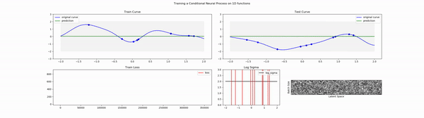

# NeuralProcesses

In this repository I want to try to implement a new type of models by the respective papers: Neural Processes [1]. This includes conditional neural processes [2] and attentive neural processes [3]

The following figure shows the learning process of the conditional neural processes. 

In the gif we can observe that the processes are learning and are able to regress the input data. When we look at the uncertainty of the model, we can observe a higher standard deviation of the model in places where no context points are, and an lower deviation in parts of context points. However, although we input a certain context point, we still see an relatively high standard deviation at these points. 

Attentive Neural processes try to improve this, by adding a weighting of the context points for the input [3].

# TODO
- Write about the implementation (Architectures, Data used etc)

### Source
[1] [Marta Garnelo et al. Neural Processes. 2018](https://arxiv.org/abs/1807.01622)

[2] [Marta Garnelo et al. Conditional Neural Processes. 2018](http://proceedings.mlr.press/v80/garnelo18a.html)

[3] [Hyunjik Kim et al. Attentive Neural Processes, 2019](https://arxiv.org/abs/1901.05761)
